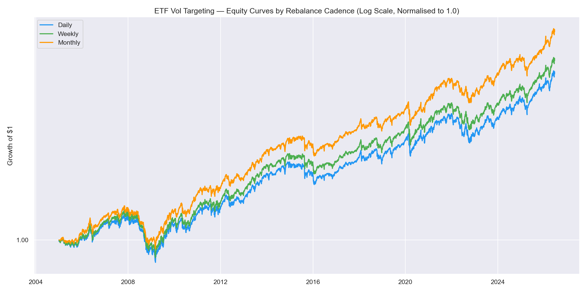
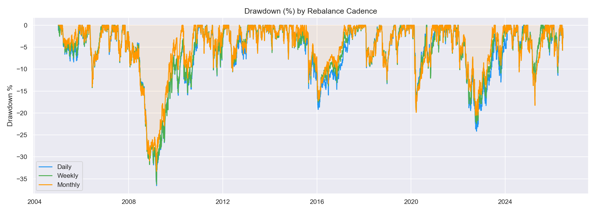
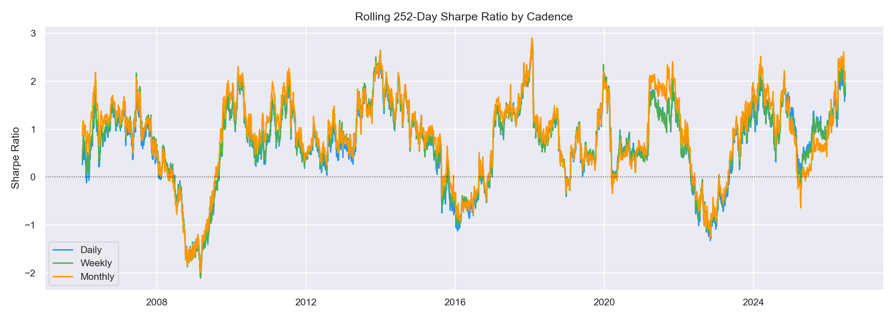
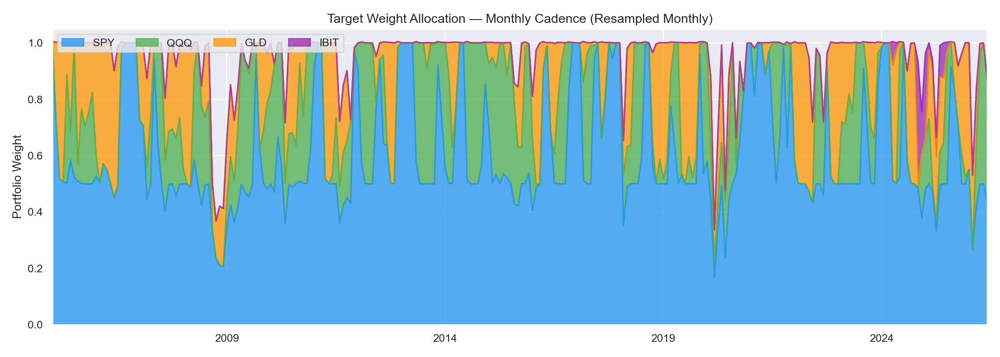
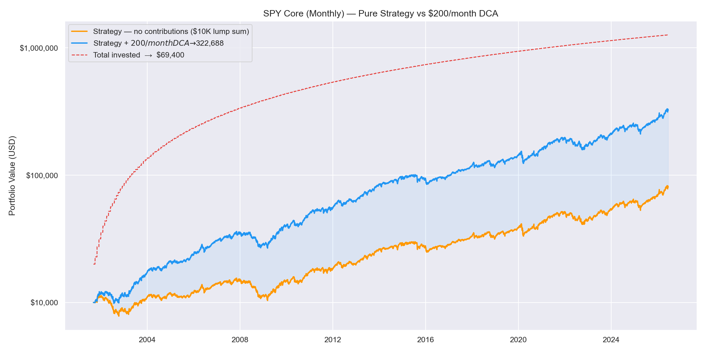

Monthly rebalancing across four CEDEAR instruments using the same
vol targeting framework as ES Core. S&P 500 as permanent core. No leverage.

<a href="../index.qmd#programs" class="back-link">← Back</a>

---

## Instrument Universe

The strategy trades four instruments via CEDEARs: SPY (S&P 500), QQQ
(Nasdaq-100), GLD (Gold), and IBIT (Bitcoin ETF).

SPY is the permanent core. The same organizing principle as ES Core applies:
U.S. large-cap equity is the benchmark against which every alternative is
evaluated on a risk-adjusted basis.

The strategy is designed for Argentine investors seeking USD-denominated
returns. CEDEARs provide access to these instruments in the local market.

---

## Strategy Design

SPY Core maintains a permanent allocation to SPY and dynamically allocates
the tactical sleeve to QQQ, GLD, and IBIT based on their risk-adjusted
performance relative to SPY.

**Framework:**

- Permanent core: SPY with hard floor at 50%
- Tactical sleeve: inverse downside semi-deviation weighted
- Sleeve qualification: rolling Sortino vs SPY > 0
- Volatility target: 10–20% downside semi-deviation
- Leverage: none (L_MAX = 1.0)
- EMA(10) smoothing + 10% no-trade band
- Signal lag: 1 day
- Cadence: weekly signal, monthly execution
- Idle capital: money market fund

---

## Backtest Results

> **These are hypothetical backtested results.** They were not achieved by
> any investor. Past hypothetical performance is not a reliable indicator
> of future results.

| Metric | SPY Buy & Hold | Monthly Cadence |
|--------|:--------------:|:---------------:|
| CAGR | 9.86% | 8.79% |
| Sharpe | 0.589 | 0.677 |
| Sortino | — | 0.633 |
| Calmar | — | 0.264 |
| Max Drawdown | -55.19% | -33.29% |
| CVaR 95% | — | -2.10% |
| CVaR 99% | — | -3.21% |
| Tail Ratio | — | 0.956 |
| Skewness | — | -0.404 |
| Kurtosis | — | 3.044 |
| Period | Sep 2001–2026 | Sep 2001–2026 |

*Backtest on USD underlyings, $10,000 lump sum, no contributions. GLD joins Nov 2004, IBIT joins Jan 2024.*

---

## Equity Curve

---

## Drawdown

---

## Rolling Sharpe

---

## Weight Allocation

---

## DCA Scenario — $200/month

What a real investor accumulates starting with $10,000 and adding $200 every month,
running the same monthly vol-targeting strategy throughout.

*Orange: pure strategy ($10K lump sum). Blue: strategy + $200/month. Red dashed: total capital invested.*

---

## Live Deployment

Live account active. Performance will be published here as it accumulates.

---

*© 2026 Dog Capital*
